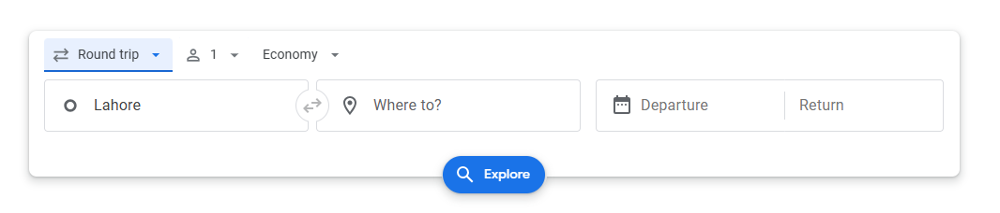
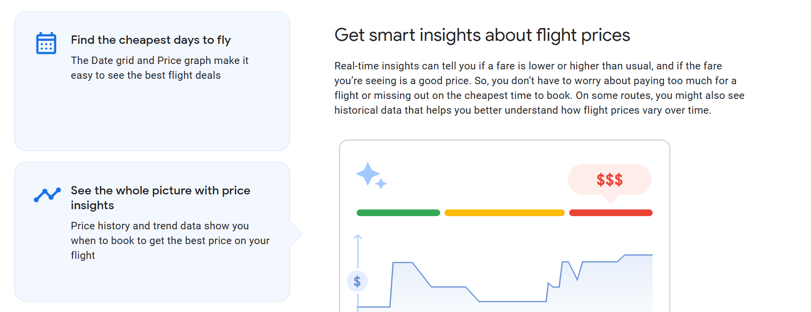
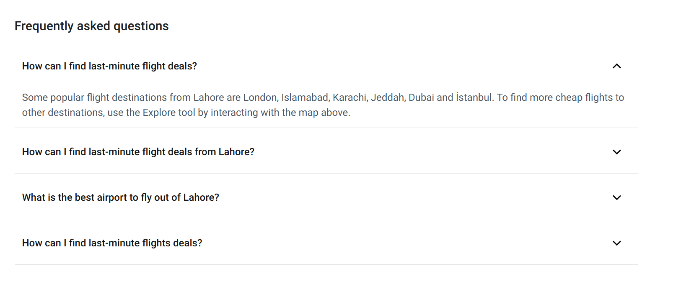
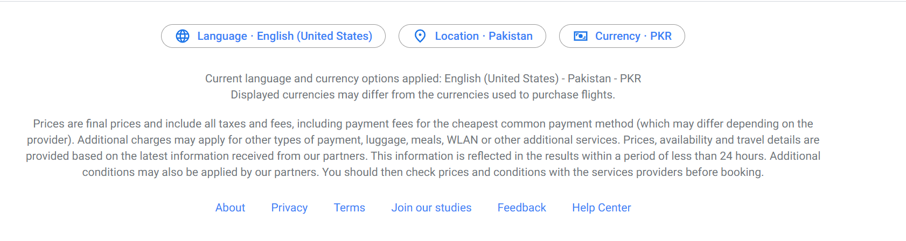
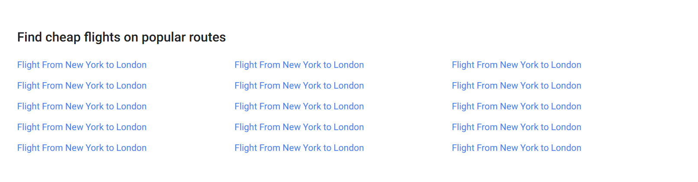
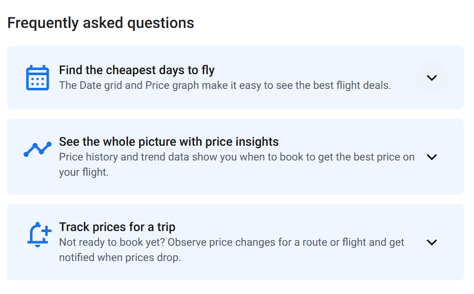
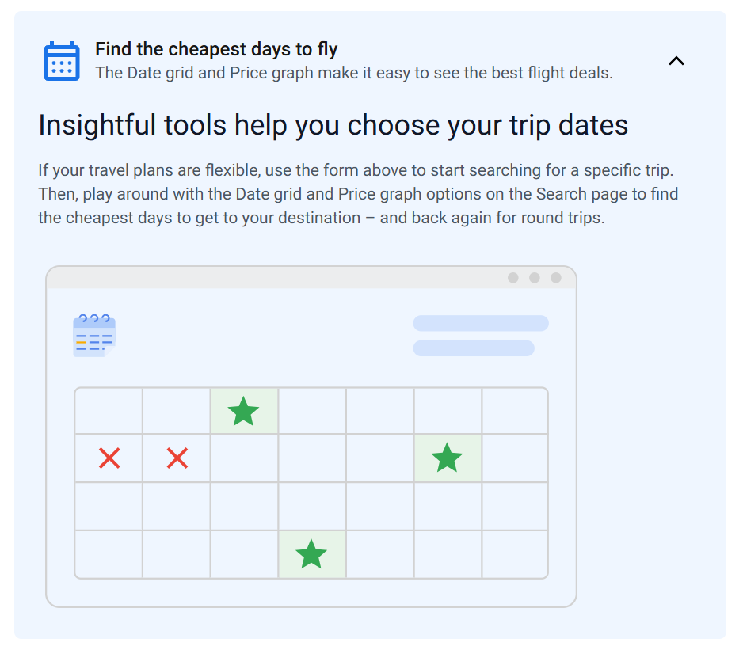
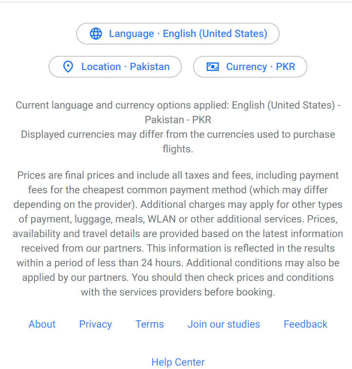
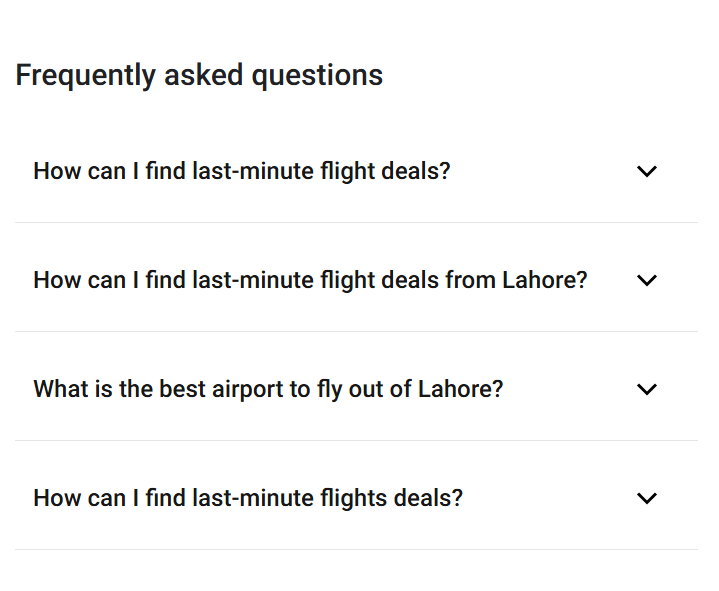
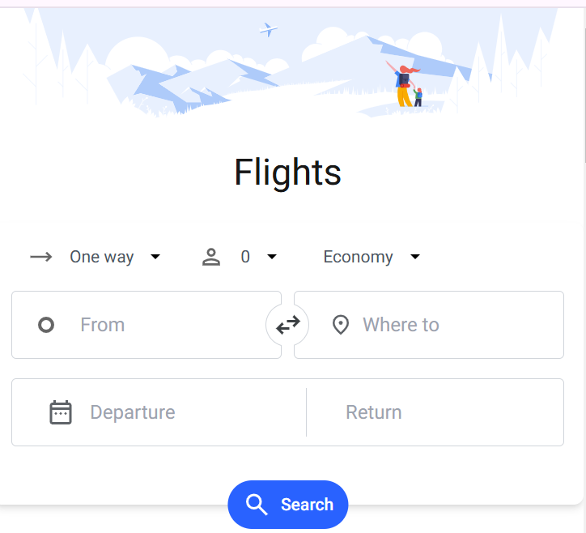

<div align="center">

  <div style="display:flex; justify-content:center; gap:20px;">
     
     
     
  </div>

  <h3 align="center">Google Flights Sample Web App</h3>

</div>

## 📋 <a name="table">Table of Contents</a>

1. 🤖 [Introduction](#introduction)
2. ⚙️ [Tech Stack](#tech-stack)
3. 🔋 [Features](#features)
4. 🤸 [Quick Start](#quick-start)
5. 🕸️ [Snippets](#snippets)
6. 🚀 [Screenshots](#screenshots)

## <a name="introduction">🤖 Introduction</a>

The **Google Flights Web App** is a modern flight search interface that enables users to easily explore and find flights based on their preferences. This web application provides a seamless and intuitive user experience by leveraging the power of cutting-edge technologies such as **Next.js** for server-rendered performance, **TypeScript** for type safety, and **Tailwind CSS** for scalable and maintainable styling.

Key highlights include the implementation of **Motion** for visually appealing animations, which enhance the overall user engagement. The app also utilizes **tailwind-merge** to optimize and streamline styling, ensuring clean and conflict-free class management.

## <a name="tech-stack">⚙️ Tech Stack</a>

- Next
- Tailwindcss
- Tailwind-Merge
- Motion
- Typescript

## <a name="features">🔋 Features</a>

### ✨ **Modern and Intuitive UI**  
- A sleek, responsive, and user-friendly interface designed for an exceptional flight search experience.  
- Optimized for both desktop and mobile users, ensuring usability across all devices.  

### 🚀 **Powered by Next.js**  
- Built with **Next.js** for unparalleled performance, including server-side rendering (SSR) and static site generation (SSG).  
- Enables faster load times and improved SEO for better search engine visibility.  

### 🎨 **Tailored Styling with Tailwind CSS**  
- Fully styled using **Tailwind CSS**, making the codebase highly maintainable and scalable.  
- Enhanced class management with `tailwind-merge` to resolve conflicting styles efficiently.  

### 🌟 **Dynamic Animations**  
- Stunning transitions and animations powered by **Framer Motion** for a smooth and modern user experience.  
- Adds a layer of interactivity, making the app visually engaging.  

### 🛡️ **Type-Safe Development**  
- Built with **TypeScript** to ensure robust type safety and minimize runtime errors.  
- Improves code maintainability and enhances the developer experience.  

### ⚡ **Flight Search Capabilities**  
- Integrated with API calls for real-time location and flight data fetching.  
- Offers multiple trip options, including one-way, round-trip, and multi-city itineraries.  

### 🛠️ **Customizable Components**  
- Modular and reusable components make it easy to extend and customize features according to business needs.  

### 🔍 **Environment-Driven Configuration**  
- Flexible environment variable support for seamless integration with external APIs and easy project setup.  


## <a name="quick-start">🤸 Quick Start</a>

Follow these steps to set up the project locally on your machine.

**Prerequisites**

Make sure you have the following installed on your machine:

- [Git](https://git-scm.com/)
- [Node.js](https://nodejs.org/en)
- [npm](https://www.npmjs.com/) (Node Package Manager)

**Cloning the Repository**

```bash
git clone https://github.com/malihassan20/Google-Flights-Sample-Web-App.git
```

**Change Directory**

```bash
cd <project-directory>
```

**Setup Your Environment Variables**

```bash
NEXT_PUBLIC_API_BASE_URL=https://api.example.com
NEXT_PUBLIC_API_KEY=your_api_key
NEXT_PUBLIC_RAPIDAPI_HOST= 'sky-scrapper.p.rapidapi.com'
```

**Installation**

Install the project dependencies using npm:

```bash
npm install
```

**Running the Project**

```bash
npm run dev
```

**Create Build for Production**

```base
npm run build
```

**Start Build**

```base
npm start
```

## <a name="screenshots">🚀 ScreenShots</a>

<p float="left">
  
  
  
  
  
  
  
  
  
  
</p>
